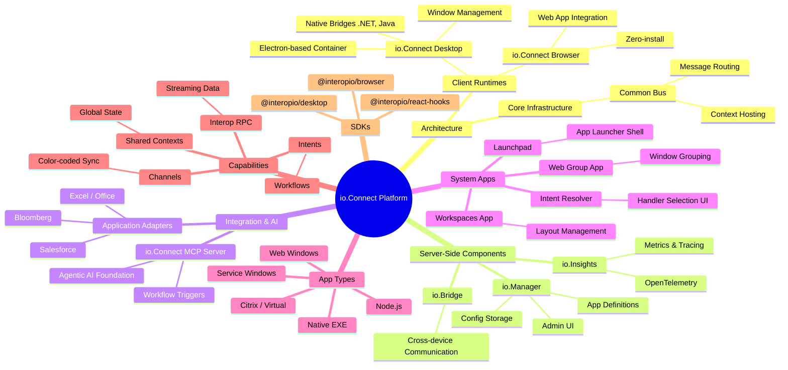

# io.Connect Platform Key Components Mindmap

**Source Notebook:** [Interop.io Platform Overview](https://notebooklm.google.com/notebook/2d380932-aed8-44d2-8813-6dec341e4400)

Based on the provided notebook, here is a hierarchical text-based mindmap of the key components of the io.Connect platform:

**Studio Artifact Reference:**
*   **Title**: io.Connect Desktop Architecture and Integration Guide
*   **Type**: Mind Map
*   **Artifact ID**: `02ca6165-f2d6-49f3-ab88-aab760ef8928`
*   **Access**: Open the [Notebook](https://notebooklm.google.com/notebook/2d380932-aed8-44d2-8813-6dec341e4400) and find this artifact in the "Saved Responses" or "Assets" panel.

